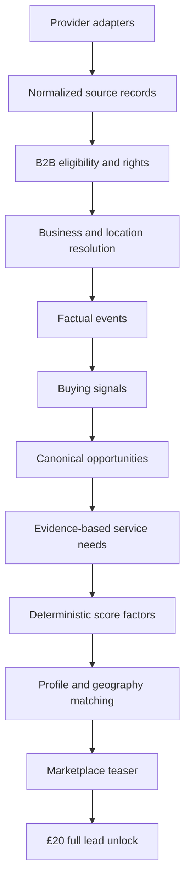

# TradeSignal architecture

TradeSignal is a B2B buying-intelligence marketplace. It is not a trade-only,
vertical-exclusive, or source-by-source subscription product.

## Product contract

- A customer describes what they sell, their ideal buyer, exclusions, and geography.
- The profile controls relevance; Local, Regional, or Nationwide controls reach.
- Every enabled and licensed source participates in one feed.
- Leads are purchased individually for £20. There is no per-vertical allowance.
- Raw source evidence remains traceable; customer-visible copy never replaces it.

## Canonical data flow

The legacy `trade_categories`, planning-opportunity, territory, and
`market_signal_trade_matches` tables remain compatibility inputs while the UI
and providers migrate. They must not gate source persistence or restrict a
customer to one vertical.

## AI boundary

AI is used for interpretation and language:

- normalize a supplier's free-text profile;
- classify source evidence into an allowed taxonomy;
- draft summaries, likely requirements, outreach, and research copy;
- return strict, versioned structured output with confidence and audit logs.

AI does **not** decide the commercial score. The canonical score is a weighted,
versioned database formula over clamped factual factors: event strength, source
authority, recency, corroboration, need fit, geography fit, contact availability,
data completeness, and buying window. Planning category fit is recomputed from
source text and taxonomy hints; the model's numeric `fit_score` is ignored.

## Provider contract

Each adapter must fetch, normalize, deduplicate, and upsert before classification.
An unmatched record is retained and synchronized into the opportunity graph; it
is never discarded because a legacy category matcher returned zero results.
Every provider has explicit rights, display/export permissions, health, usage,
cost, and ingestion-run records. Secrets live only in server or Edge Function
configuration.

## Customer experience

The authenticated journey is:

1. Complete the business profile and select geographic reach.
2. Browse or map matched opportunities across all relevant B2B categories.
3. Save or dismiss teasers and inspect evidence and score reasons.
4. Unlock a full lead and retain it in Purchased leads.
5. Research, contact, track, export, or hand off to CRM.

Admin and operational routes are separate from this primary journey. Experimental
integrations stay behind clear availability states and must not appear as working
actions until their server-side workflow is connected.

## Completion gates

- All configured providers report fetch/upsert/graph-sync counts and failures.
- No active provider path filters normalized records through a legacy vertical gate.
- Every customer-visible opportunity has eligible B2B evidence and source attribution.
- Every score can be reproduced from stored factor rows and a formula version.
- Profile/geography matching never requires a subscribed vertical.
- RLS, grants, function privileges, and Supabase security advisors pass before release.
